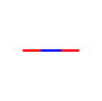
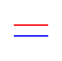
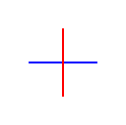
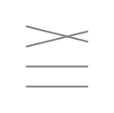
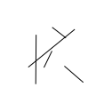
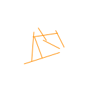
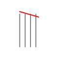

# Segment Intersection Test Set
These tests are based on a simple CSV format where each line represents a segment:
```
x1;y1;x2;y2
```
Each coordinate (x1, y1, x2, y2) is stored as a 64-bit **binary double** for precision and performance in spatial algorithms.

## Table of Contents
1. [Parallel and Collinear](#1-parallel-and-collinear)
2. [Length 0](#2-length-0)
3. [Multi-Axis](#3-multi-axis)
4. [Star Intersections](#4-star-intersections)
    - [Performance Test 1 (Star Intersections 9)](#41-performance-test-1-test-9)
    - [Performance Test 2 (Star Intersections 10)](#42-performance-test-2-test-10)
    - [Integer Test (Star Intersections 11)](#43-integer-test-test-11)
5. [Accuracy](#5-accuracy)
6. [Random](#6-random)
7. [Clustered](#7-clustered)
8. [Rounding](#8-rounding)

---


## 1. Parallel and Collinear



Tests for segments that are:
- Perfectly parallel
- Collinear but non-intersecting
- Collinear and overlapping

## 2. Length 0


Includes segments of zero length to test degenerate cases:
- Points instead of lines
- Multiple overlapping zero-length segments

## 3. Multi-Axis


Segments intersecting across multiple axes:
- Horizontal, vertical, diagonal combinations
- Ensures handling of various orientations

## 4. Star Intersections


Segments radiating from a common point:
- Simulates radial intersections
- Tests high-density overlap at a single node

## 4.1 Performance Test 1 (Test 9)


A large-scale performance benchmark:
- Tests the algorithm's time and memory handling

## 4.2 Performance Test 2 (Test 10)


Another performance-intensive case:
- Different segment distribution and density

## 4.3 Integer Test (Test 11)


Segments with strictly integer coordinates:
- Checks for precision and correctness in integer-only space

## 5. Accuracy


Tests for floating-point precision:
- Near misses, very close intersections
- Ensures numerical stability

## 6. Random



Randomly generated test cases:
- Includes edge cases
- **Also contains an integer-only test**

## 7. Clustered


Segments grouped tightly in specific regions:
- Stress test for spatial indexing or sweep-line behavior

## 8. Rounding


Cases that are sensitive to rounding:
- Intersections near coordinate boundaries
- **Includes the same tests as above but rotated vertically**